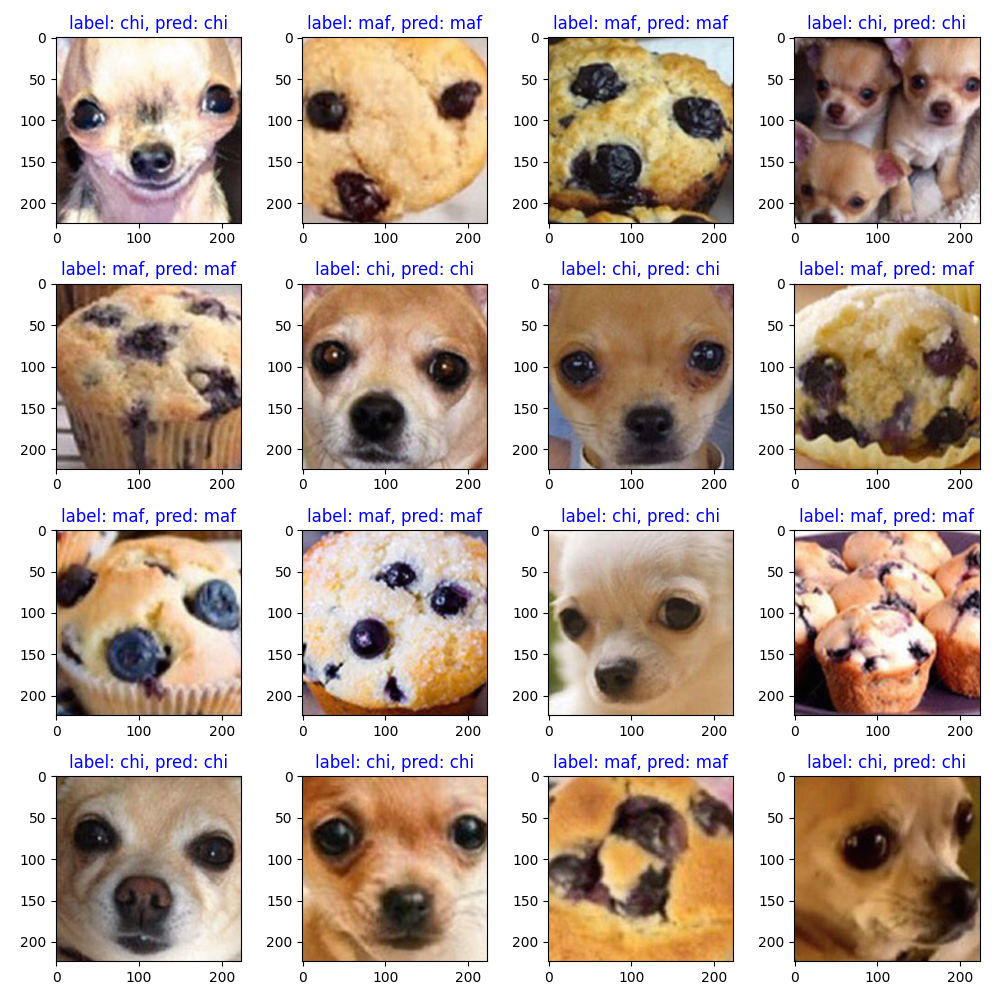

# chihuahua-maffin-classification
chihuahua or maffin classification using pytorch
## train
run train.py
without pretrained model:
```bash
python train.py
```
with pretrained model:
```bash
python train.py --resume checkpoint/model.pth
```

## demo
run demo.py
```bash
python demo.py 
```

## result

